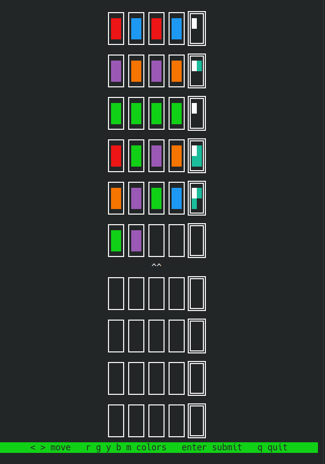
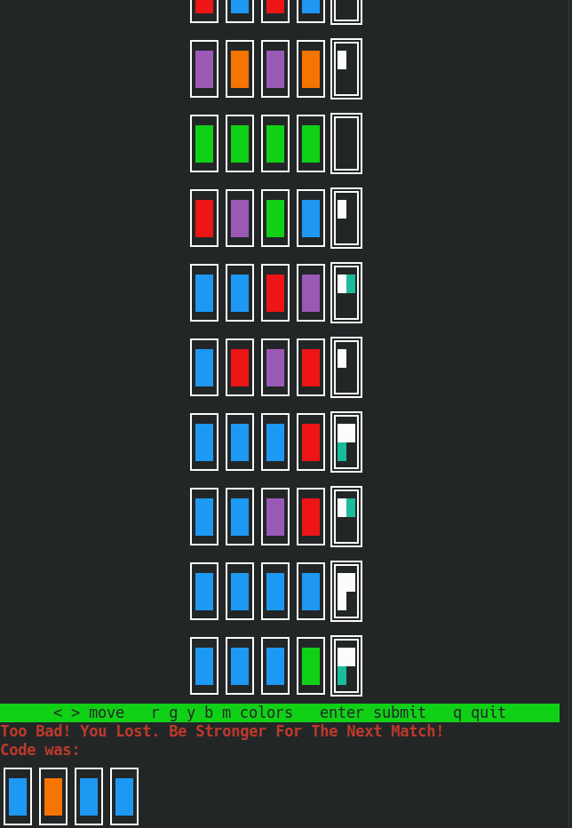

# Mastermind

A terminal implementation of Mastermind, rendered with ANSI escape codes and box-drawing characters. No dependencies — Python standard library only.

Ported from an Arduino/C++ version that ran on a 16×2 LCD with a matrix keypad.



---

## The game

A secret code of **4 colors** is drawn from 5 possibilities, with repeats allowed. You have **10 guesses**. After each guess the board tells you how close you were — but not *where* you were right.

## The board

Each row is one guess: four color blocks, then a double-bordered result block.

```
┌──┐┌──┐┌──┐┌──┐╔══╗
│  ││  ││  ││  │║  ║     ← four guessed colors, then the feedback pins
│  ││  ││  ││  │║  ║
└──┘└──┘└──┘└──┘╚══╝
         ^^              ← cursor marks the position you're editing
```

The result block holds **four pins**, read left-to-right, top-to-bottom:

| pin | meaning |
|---|---|
| **white** | one color is correct *and* in the correct position |
| **cyan** | one color is correct but in the *wrong* position |
| empty | no match |

The pins are deliberately **unordered with respect to your guess**. Two white pins tell you two positions are right; they don't tell you which two. That ambiguity is the game.

Run out of guesses and the secret code is revealed:



Colors are drawn from the terminal's own 8-color palette, so exact hues follow your color
scheme — magenta often reads as violet, yellow as orange. Only distinguishability matters.

## Controls

| key | action |
|---|---|
| `r` `g` `y` `b` `m` | place red / green / yellow / blue / magenta |
| `,` or `<` | move cursor left |
| `.` or `>` | move cursor right |
| `Enter` | submit the guess (only when all four slots are filled) |
| `q` | quit |

Placing a color advances the cursor automatically, so a full guess is four keystrokes and Enter.

---

## Running it

```bash
git clone https://github.com/MrBraiiv/Mastermind-Py
cd Mastermind-Py
python3 main.py
```

**Requires Python 3.12+.** Two 3.12 behaviors are load-bearing: `tty.setcbreak()` returning the previous terminal attributes, and value containment on `Enum` classes (`'r' in Colors`).

**Unix only.** The `termios`/`tty` modules do not exist on Windows.

**Terminal size:** the board renders 10 rows × 4 lines, plus a cursor line and a controls bar — roughly 42 lines. Resize your terminal taller than that or it will scroll.

---

## How the rendering works

There is no rendering library here. Four mechanisms do all of it.

**Color** is an ANSI background code wrapping two spaces, printed on two consecutive lines.
Terminal cells are about twice as tall as they are wide, so a 2×2 cell interior renders as an
upright rectangle rather than a square — which is what gives the board its peg-like look.

```
\033[41m  \033[0m     →  one red line; two of them stacked make a peg
```

**Structure** is Unicode box drawing — `┌ ─ ┐ │ └ ┘` for guesses, and the double-line
set `╔ ═ ╗ ║ ╚ ╝` for result blocks, so feedback is distinguishable from input at a glance
without relying on color alone.

**The frame is redrawn whole, every keypress.** The cursor is homed to the top-left
(`\033[H`) and the entire board is printed over the previous frame. There is no partial
update and no diffing: `display.render()` is a pure function of game state. This is
immediate-mode rendering — the same approach the LCD version used, where `render(GameState*)`
rewrote both rows on every change.

**Blocks are composed slice by slice.** A terminal prints line by line, so a row of five
blocks cannot be drawn one block at a time. Each block is built as four horizontal *slices*,
and rendering a row means concatenating slice `i` of every block before printing:

```python
'\n'.join(''.join(block[i] for block in blocks) for i in range(4))
```

## Layout

```
main.py       entry point — enters cbreak mode, starts the loop
loop.py       input dispatch, board construction, end-game messages
game.py       rules, scoring, state. Knows nothing about terminals.
board.py      view model — Board / Row / ColorBlock / ResultBlock
display.py    game state → printable strings. Owns every escape code.
terminal.py   cbreak context manager + ANSI and box-drawing tables
keys.py       raw keypress → semantic action
constants.py  dimensions, enums, messages
```

The boundary that matters is between `game.py` and `display.py`. `game.py` stores colors as
names (`'red'`), never as escape sequences; nothing in it would need to change to drive a GUI,
a test harness, or a replay file. That separation is inherited from the C original, where
`game.cpp` contained no hardware calls and `display.cpp` did all the LCD writes.

---

## Notes from the port

The original ran on an Arduino: 16×2 LCD, 3×4 matrix keypad, plus a servo, RGB LED,
piezo buzzer, and a light sensor. The peripherals were dropped. What is interesting is
what changed in the parts that stayed.

**Scoring lost its bookkeeping.** Counting how many colors two codes share — regardless of
position — took two 6-element count arrays and a per-symbol `min` loop in C:

```c
static byte totalMatches(char *secret, char *guess) {
    byte secretCounts[6] = {0}, guessCounts[6] = {0};
    for (byte i = 0; i < 4; i++) {
        secretCounts[symbolIndex(secret[i])]++;
        guessCounts[symbolIndex(guess[i])]++;
    }
    byte total = 0;
    for (byte i = 0; i < 6; i++)
        total += min(secretCounts[i], guessCounts[i]);
    return total;
}
```

In Python the counting *is* the data structure:

```python
code_count, guess_count = Counter(code), Counter(guess)
color_matches = sum(min(code_count[c], guess_count[c]) for c in code_count)
```

The `symbolIndex(c) { return c - 'A'; }` helper — mapping a character to an array offset —
has no counterpart at all. The C version needed colors to be contiguous letters so they could
index an array. Python's counter is keyed by the color itself, so the constraint disappears
and the colors can be named whatever reads best.

**An entire state disappeared.** The Arduino version had a `HISTORY` mode with
`historyLine`, `handleScrollUp`, `handleScrollDown`, and `handleExitHistory` — because a
two-line display can only show one past guess at a time. A terminal has no such limit. Every
guess and its feedback stay on screen permanently, and roughly a third of the input handling
existed only to work around the LCD.

**Cleanup became a language feature.** Restoring terminal attributes on exit is the same
obligation as freeing a buffer, and `with` makes it structural rather than a discipline:

```python
with terminal.Cbreakmode():
    loop.play(game.Game())
```

`__exit__` restores the saved `termios` state and re-shows the cursor on any exit path,
including an exception. Forget it and the shell is left with no echo until `reset`.

---

## Known issues

- `History` stores guesses, exacts, and misplaced counts as three parallel lists indexed by
  turn — a direct transcription of the C struct's parallel arrays. One list of turn records
  would be the correct Python shape.
- The board can exceed the terminal height and scroll; there is no size check or adaptive layout.
- The end-of-game code reveal is printed flush left while the board above it is centered —
  `repr_colors` does not apply the shared padding.
- No test suite. Scoring in particular is a pure function and should have one.
